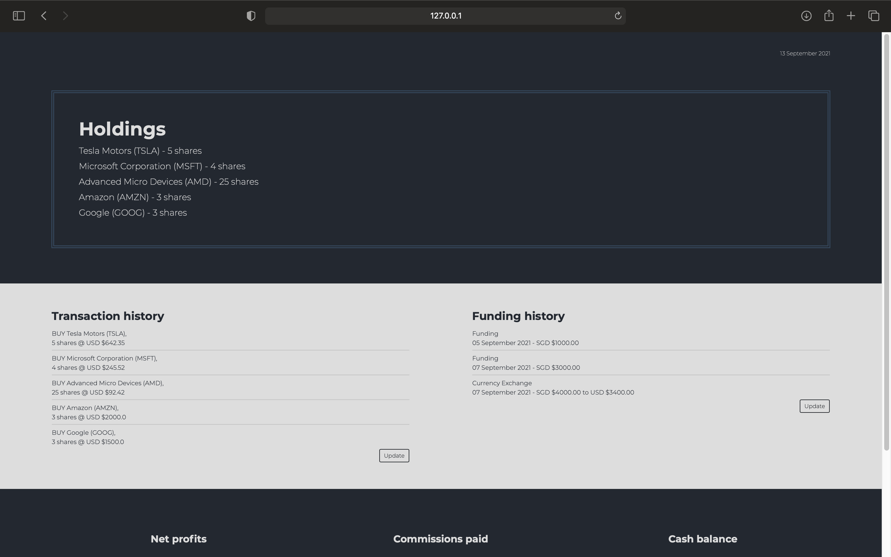
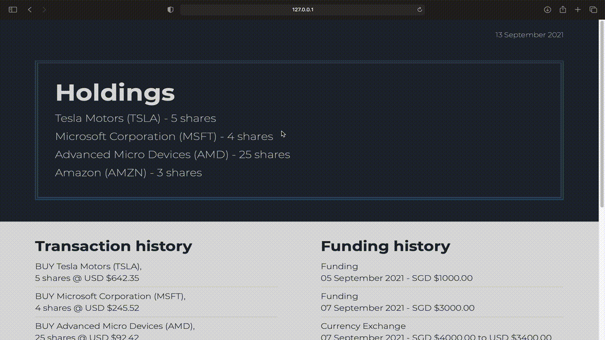

# Investment Portfolio

A web application to track investment holdings and histories. Serves as a convenient way to keep track of one's investment portfolio.

Started as a project to learn the basics of web development

## Motivation

With the emergence of multiple brokers for the stock market, each offering its own pros and cons, investors may choose to use multiple brokers at the same time. This makes it hard to keep track of holdings across different brokerage accounts. There thus needs to be a single point of truth, which can be found in this web application.

## Features

* Display your centralised stock holdings, which changes with your transaction history
* Keep track of funding history, including currency exchanges
* Calculates profits earned and commissions paid based on transactions

## Tech Stack

1. Python
2. HTML/CSS/JavaScript
3. Flask
4. MongoDB
5. jQuery
